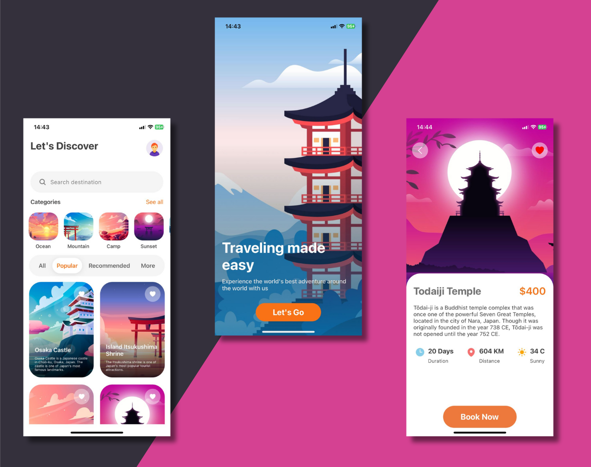

<h1 align='center'>Travel App Ui</h1>

# Description

Project made by <a href='https://www.youtube.com/watch?v=vV9zIDgT4Ik' target='_blank'>Code With Nomi</a>

An app to book trips around the World.

- Made for me to understand and learn more about React Native and real Navigations

# Get Started
- Clone the repository by `git clone https://github.com/nicoryy/TravelAppUi`
- Install dependencies `npm i`
- Run `npm start` and run the project in Expo GO app

# Tecnologies 

    
    
    

# Dependencies
- React Navigator
- NativeWind
- TailWindCss
- HeroIcons
